<!-- footer: 'https://github.com/codebytes/dotnet-configuration-in-depth' -->

# .NET Configuration in Depth
## Chris Ayers

---

## Chris Ayers
### Senior Customer Engineer Microsoft

<i class="fa-brands fa-twitter"></i> Twitter: @Chris\_L\_Ayers
<i class="fa-brands fa-mastodon"></i> Mastodon: @Chrisayers@hachyderm.io
<i class="fa-brands fa-linkedin"></i> LinkedIn: - [chris\-l\-ayers](https://linkedin.com/in/chris-l-ayers/)
<i class="fa fa-window-maximize"></i> Blog: [https://chris-ayers\.com/](https://chris-ayers.com/)
<i class="fa-brands fa-github"></i> GitHub: [Codebytes](https://github.com/codebytes)

---

# Agenda
- What is configuration?
- How does .NET Framework handle configuration?
- How does .NET and ASP.NET handle configuration?
- Configuration Providers
- Configuration Binding
- The Options Pattern
- Questions?

---

## What is Configuration?

## <i class="fa fa-sliders"></i> Settings
- Retry Times
- Queue Length 

## <i class="fa-sharp fa-solid fa-flag"></i> Feature Flags
- Per User
- Percentage

## <i class="fa fa-key"></i> Secrets
- Connection Strings
- App Registration

---

# When is configuration applied?

## <i class="fa fa-code"></i> Compile Time

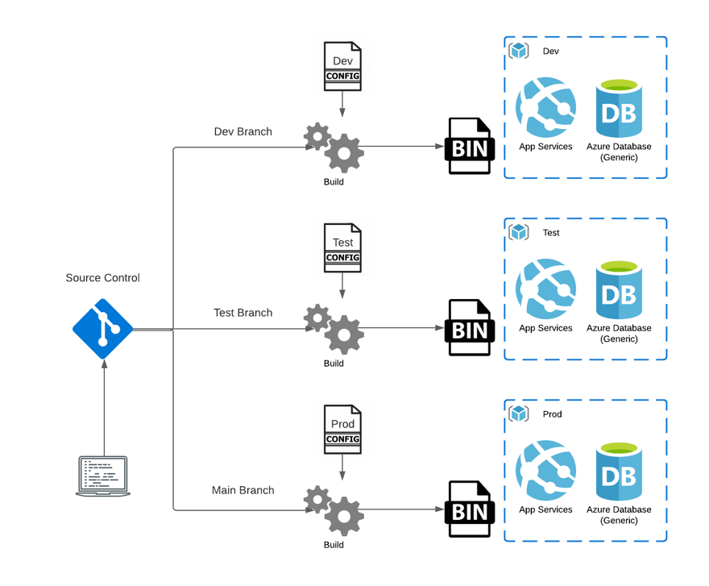

## <i class="fa-solid fa-file-code"></i> Run Time

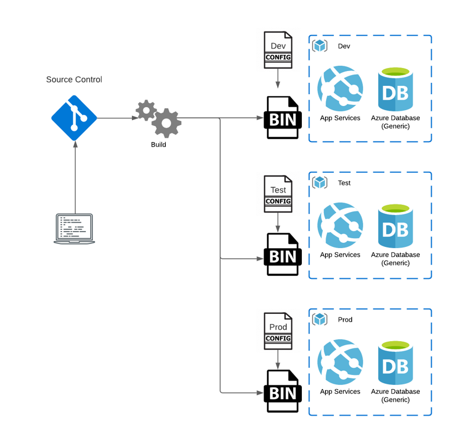

---

# .NET Framework Configuration

---

# Web.Config

* Limited to Key\-Value string pairs
* Accessed through a static ConfigurationManager Class
* Dependency Injection was not provided out of the box
* Transformation through difficult syntax
  * Slow Cheetah
* Hard to unit test
* Easy to leak secrets

---

# XML, Static Classes, and Parsing

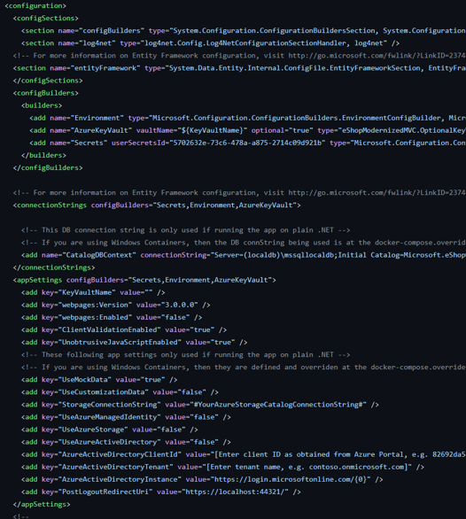

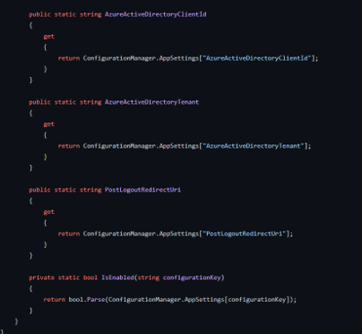

---

# .NET 6/ASP.NET Configuration

---

# Configuration Providers

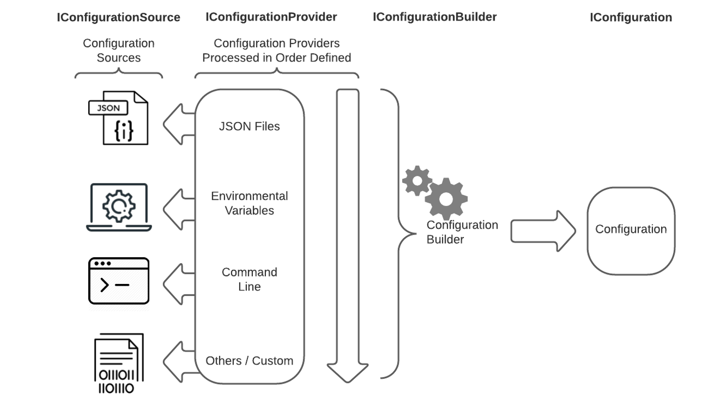

---

# Order Matters

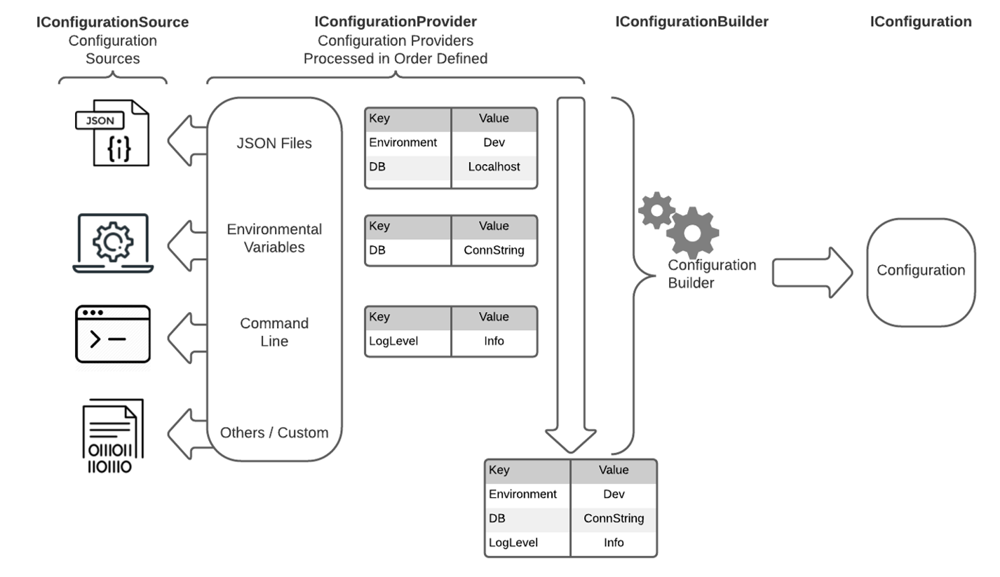

---

# Keys are flattened

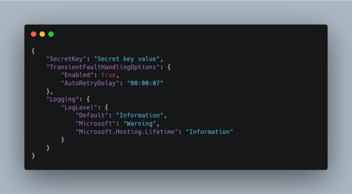

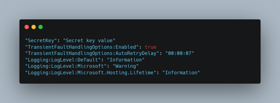

---

# Binding a Section

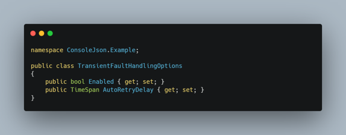

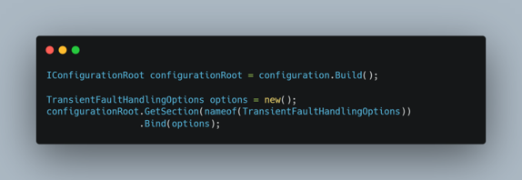

---

# Out of the Box

## <i class="fa fa-terminal"></i> Console
- No Configuration 

## <i class="fa-regular fa-window-maximize"></i> ASP.NET
- JSON
  - appsettings.json
  - appsettings.{Environment}.json
- Environment Variables
- Command Line Variables
- User Secrets

---

# Configuration Providers

## File-based
- JSON 
- XML 
- INI 
- Key-per-file

## Others

- Environment variables 
- Command-line
- In-Memory
- User Secrets
- Azure Key Vault
- Azure App Configuration

---

# Json Provider

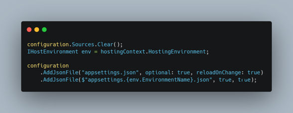

---

# Xml Provider

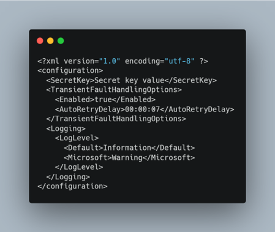

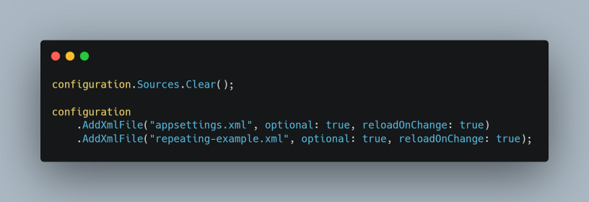

---

# Environment Variables

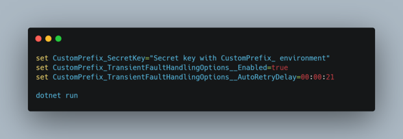

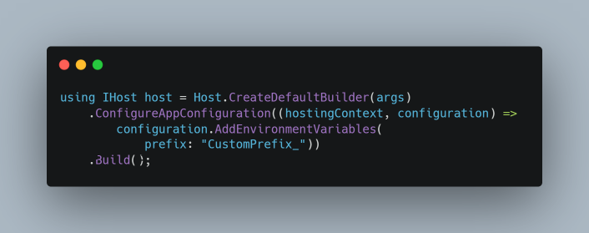

---

# Command Line Variables

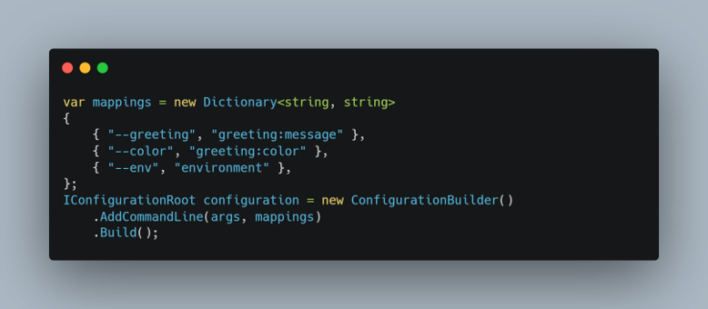

---

# Key-per-file

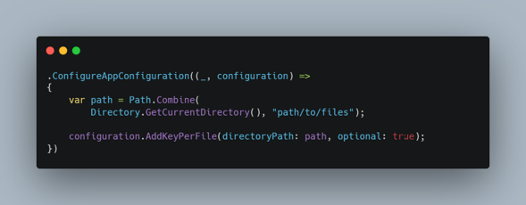

---

# In Memory

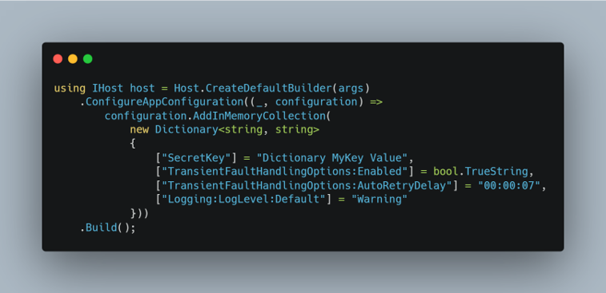

---

# DEMOS

---

# The Options Pattern

The **Interface Segregation Principle (ISP)**  or Encapsulation: Scenarios (classes) that depend on configuration settings depend only on the configuration settings that they use.

**Separation of Concerns** : Settings for different parts of the app aren't dependent or coupled to one another.

---

# Types of IOptions

|  | Singleton | Reloading Support | Named Option Support |
| :-: | :-: | :-: | :-: |
| IOptions<T>  | Yes | No | No |
| IOptionsSnapshot<T>  | No | Yes | Yes |
| IOptionsMonitor<T>  | Yes | Yes | Yes |

---

# DEMOS

---

# Questions?

---

## Resources

#### GitHub Repo
#### https://github.com/codebytes/dotnet-configuration-in-depth

#### Blog
#### https://chris-ayers.com

## Contact

<i class="fa-brands fa-twitter"></i> Twitter: @Chris\_L\_Ayers
<i class="fa-brands fa-mastodon"></i> Mastodon: @Chrisayers@hachyderm.io
<i class="fa-brands fa-linkedin"></i> LinkedIn: - [chris\-l\-ayers](https://linkedin.com/in/chris-l-ayers/)
<i class="fa fa-window-maximize"></i> Blog: [https://chris-ayers\.com/](https://chris-ayers.com/)
<i class="fa-brands fa-github"></i> GitHub: [Codebytes](https://github.com/codebytes)

